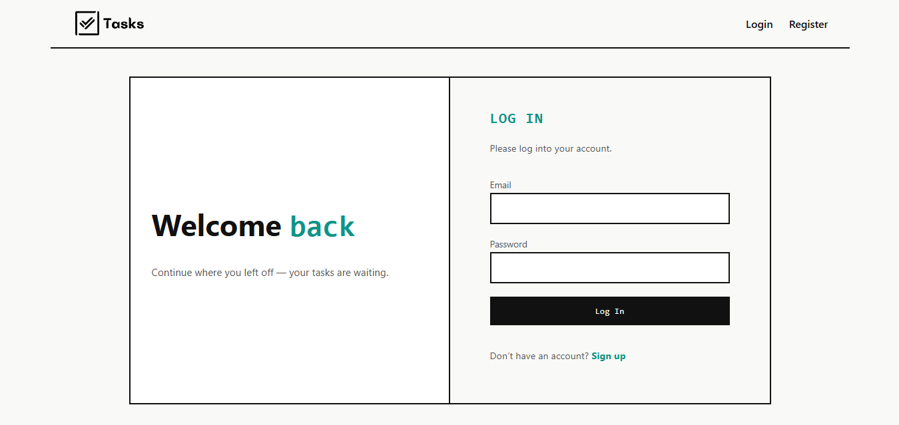
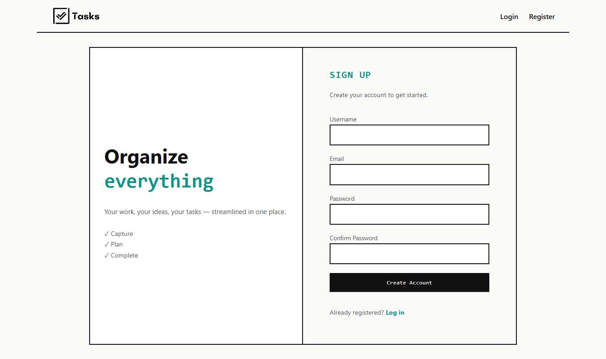
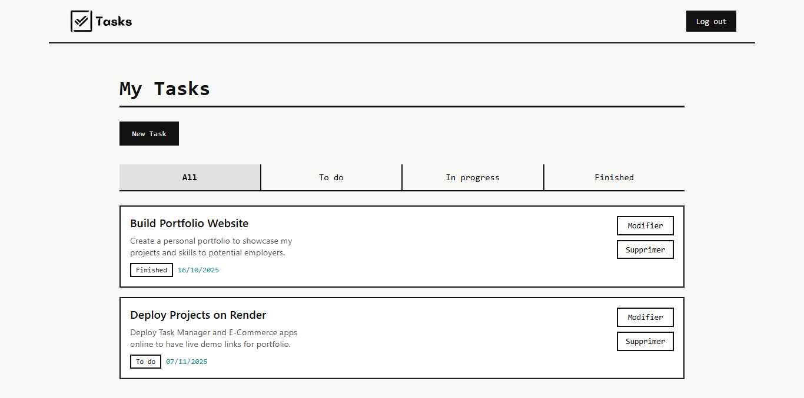
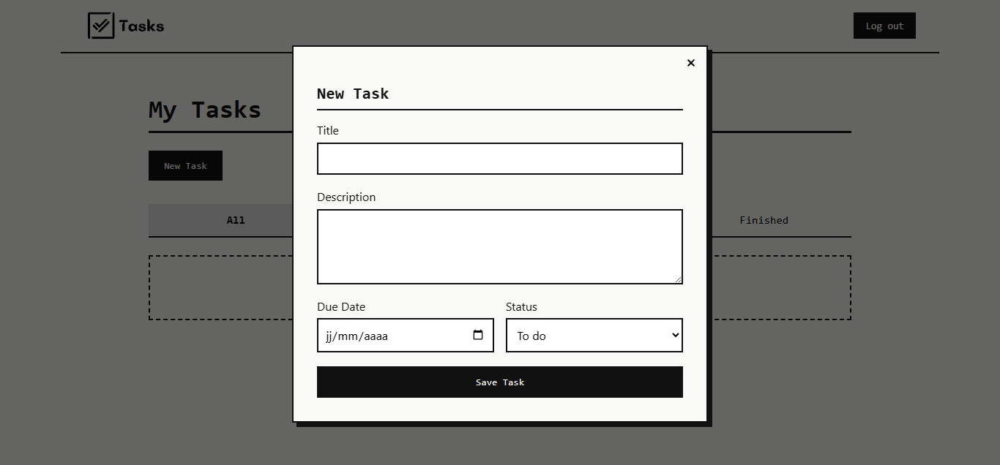

# Task Manager Full-Stack

A full-stack task management application with secure user authentication. Users can create personal accounts, manage their tasks with full CRUD operations, and filter tasks by status.

## Technologies

### Backend
- **Runtime:** Node.js
- **Framework:** Express.js
- **Database:** MongoDB with Mongoose ODM
- **Authentication:** JWT (JSON Web Tokens)
- **Security:** bcrypt.js for password hashing

### Frontend
- **Library:** React.js 19
- **State Management:** Redux Toolkit
- **Routing:** React Router DOM v7
- **HTTP Client:** Axios
- **Build Tool:** Vite

## Features

- **User Authentication**
  - User registration with validation
  - Secure login with JWT tokens
  - Password hashing with bcrypt
  - Protected routes

- **Task Management**
  - Create, read, update, and delete tasks
  - Task properties: title, description, status, due date
  - Filter tasks by status (All, To do, In progress, Finished)

- **User Experience**
  - Responsive modal for task creation/editing
  - Form validation with error messages
  - Loading spinners during async operations
  - Clean and intuitive UI

## Screenshots

### Login Page


### Register Page


### Dashboard with Tasks


### Task Form Modal


## Project Structure

```
task-manager-app/
├── task-manager-backend/
│   ├── controllers/
│   │   ├── taskController.js
│   │   └── userController.js
│   ├── middleware/
│   │   └── authMiddleware.js
│   ├── models/
│   │   ├── Task.js
│   │   └── User.js
│   ├── routes/
│   │   ├── taskRoutes.js
│   │   └── userRoutes.js
│   ├── index.js
│   ├── .env
│   └── package.json
│
└── task-manager-frontend/
    ├── src/
    │   ├── app/
    │   │   └── store.js
    │   ├── assets/
    │   │   └── styles/
    │   ├── components/
    │   │   ├── Header.jsx
    │   │   ├── PrivateRoute.jsx
    │   │   ├── AuthRoute.jsx
    │   │   ├── Spinner.jsx
    │   │   ├── TaskForm.jsx
    │   │   ├── TaskItem.jsx
    │   │   └── TaskList.jsx
    │   ├── features/
    │   │   ├── auth/
    │   │   │   ├── authService.js
    │   │   │   └── authSlice.js
    │   │   └── tasks/
    │   │       ├── taskService.js
    │   │       └── taskSlice.js
    │   ├── pages/
    │   │   ├── Dashboard.jsx
    │   │   ├── Login.jsx
    │   │   └── Register.jsx
    │   ├── App.jsx
    │   └── main.jsx
    └── package.json
```

## API Endpoints

### Authentication
| Method | Endpoint | Description | Access |
|--------|----------|-------------|--------|
| POST | `/api/users/register` | Register new user | Public |
| POST | `/api/users/login` | Login user | Public |
| GET | `/api/users/me` | Get current user | Private |

### Tasks
| Method | Endpoint | Description | Access |
|--------|----------|-------------|--------|
| GET | `/api/tasks` | Get all user tasks | Private |
| POST | `/api/tasks` | Create new task | Private |
| GET | `/api/tasks/:id` | Get single task | Private |
| PUT | `/api/tasks/:id` | Update task | Private |
| DELETE | `/api/tasks/:id` | Delete task | Private |

## Installation

### Prerequisites
- Node.js (v18 or higher)
- MongoDB (local or Atlas)
- npm or yarn

### Backend Setup

```bash
cd task-manager-backend
npm install
```

Create a `.env` file:
```env
PORT=3000
DB_URI=mongodb://localhost:27017/task_manager_db
JWT_SECRET=your_secret_key_here
```

Start the server:
```bash
npm run dev
```

### Frontend Setup

```bash
cd task-manager-frontend
npm install
npm run dev
```

The application will be available at `http://localhost:5173`

## Environment Variables

### Backend
| Variable | Description |
|----------|-------------|
| `PORT` | Server port (default: 3000) |
| `DB_URI` | MongoDB connection string |
| `JWT_SECRET` | Secret key for JWT signing |

## Future Improvements

- [ ] Add task priority levels
- [ ] Add due date notifications
- [ ] Add task search functionality
- [ ] Add dark mode
- [ ] Add task categories/tags

## Author

Mohamed Chaker Ouaaddi

⭐ If you found this project helpful, please give it a star!
